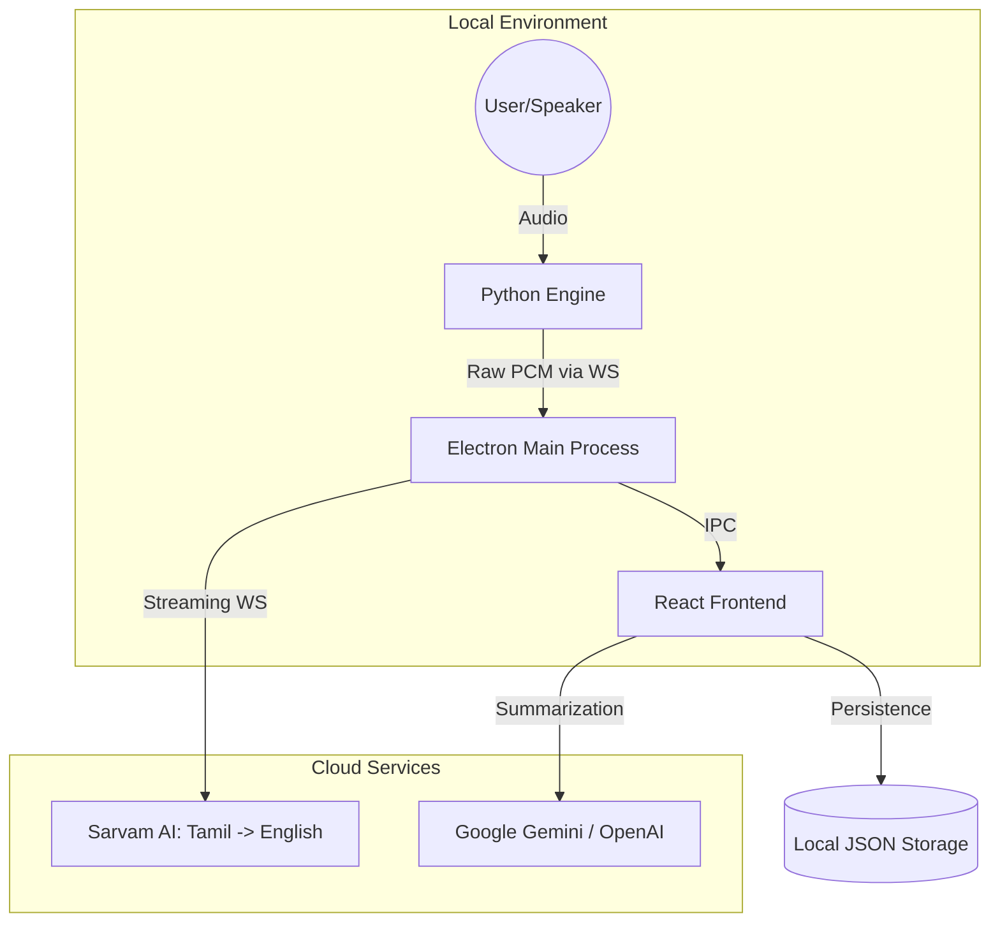

# 🍊 Tangola: Multilingual Meeting Intelligence for Bharat

[](https://www.electronjs.org/)
[](https://react.dev/)
[](https://www.python.org/)
[](https://sarvam.ai/)

**Tangola** is a meeting assistant built for the unique linguistic landscape of India. It bridges the gap between how we speak and how we document: **working in our native languages, but writing in English.**

> "India works in a multitude of languages, but the professional world writes in English. Tangola makes that transition seamless and invisible."

---

## 🏗️ Architecture & Data Flow

Tangola is split into two primary components: the **Dashboard** (Electron/React) and the **Engine** (Python).



1.  **Audio Capture**: The Python engine captures system or microphone audio using low-level adapters (WASAPI/CoreAudio).
2.  **Streaming**: Audio is streamed via a local WebSocket (`ws://localhost:8765`) to the Electron app.
3.  **Transcription**: Electron forwards the stream to Sarvam AI for real-time translation.
4.  **Display**: The React dashboard renders transcripts with glassmorphic aesthetics.

---

## ✨ Key Features

-   **Speak Indic, Write English**: Seamlessly transcribe Tamil (and soon other Indian languages) and automatically translate to professional English.
-   **Bridging the Gap**: Intelligent, structured meeting notes that capture the nuances of Indian multilingual conversations.
-   **Native Experience**: A high-performance, dark-mode interface designed for long business meetings.
-   **Cross-Platform**: Optimized for macOS (Silicon/Intel) and Windows with low-latency local audio capture.
-   **Local Reliability**: Heartbeat-monitored connection ensures your transcription never drops out.

---

## 🛠️ Tech Stack

-   **Frontend**: React 19, Vite, TypeScript, Vanilla CSS.
-   **Desktop Shell**: Electron 41.
-   **Backend Engine**: Python 3.11+, `websockets`, `soundcard`/`pyaudio`.
-   **Package Managers**: `bun` / `npm` (Frontend), `uv` (Python).
-   **AI Providers**: Sarvam AI (STTT), Google Gemini, OpenAI.

---

## 🚀 Getting Started

### Prerequisites

-   [Node.js](https://nodejs.org/) (v20+) or [Bun](https://bun.sh/)
-   [Python 3.11+](https://www.python.org/)
-   Sarvam AI API Key (Get it at [sarvam.ai](https://www.sarvam.ai/))

### 1. Clone & Environment
```bash
git clone https://github.com/Raikan10/Tangola.git
cd Tangola
cp dashboard/.env.example dashboard/.env # Add your API keys here
```

### 2. Setup the Engine (Python)
```bash
cd engine
pip install uv # If you don't have it
uv sync        # Creates a managed venv and installs deps
```

### 3. Setup the Dashboard (Electron)
```bash
cd dashboard
npm install
```

### 4. Run Development Mode
Starts the Vite dev server, the local Python engine, and launches Electron:
```bash
npm run dev:engine
```

---

## 📦 Building for Production

Tangola uses `electron-builder` and a custom script to bundle the Python engine into the app.

-   **macOS**: `npm run build:mac`
-   **Windows**: `npm run build:win`

The production build includes a pre-compiled Python environment and the engine logic as an internal resource.

---

## 🗺️ Roadmap

Check out [TODOS.md](TODOS.md) for the full roadmap.

-   [ ] **Phase 5**: Expand support to Hindi, Telugu, and Kannada.
-   [ ] **Phase 6**: Authentication (Supabase) & Cloud Sync for team collaboration.
-   [ ] **Phase 7**: Speaker Identification & Razorpay Integration (optimized for UPI).

---

*Built with ❤️ by Raikan10*
